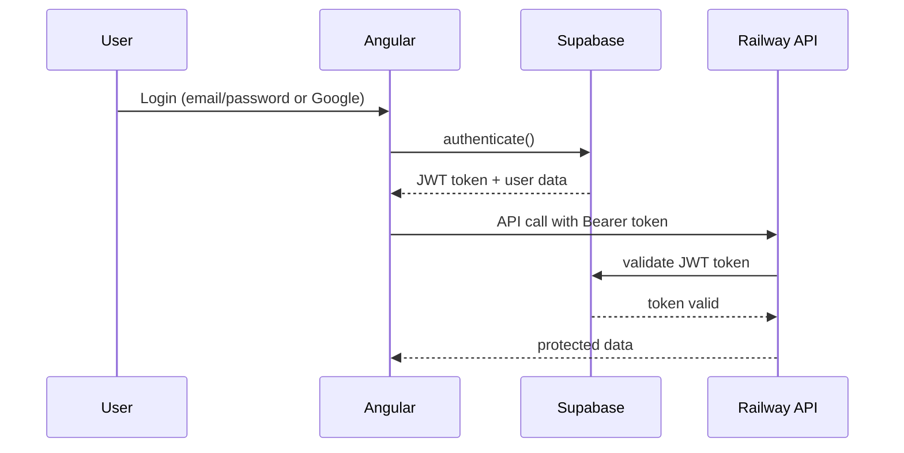

# Frontend-Backend Integration Guide

## Overview

This document outlines the systematic integration between the Angular frontend and the .NET Railway API backend for the Civica platform.

## Integration Architecture

### Dual-Mode Operation
The frontend operates in two modes controlled by `environment.mockMode`:
- **Development/Testing**: Uses mock services for rapid development
- **Production**: Connects to real Railway API with Supabase authentication

### Service Layer Architecture
```
┌─────────────────────────────────────────────────┐
│                  Components                      │
├─────────────────────────────────────────────────┤
│               NgRx Store                        │
├─────────────────────────────────────────────────┤
│          Integration Services                   │
│  ┌─────────────────┬─────────────────────────┐  │
│  │   Mock Services │    Real API Services    │  │
│  └─────────────────┴─────────────────────────┘  │
├─────────────────────────────────────────────────┤
│            HTTP Interceptors                    │
├─────────────────────────────────────────────────┤
│               HTTP Client                       │
└─────────────────────────────────────────────────┘
```

## Implementation Status

### ✅ Phase 1: Environment & Configuration
- [x] Updated environment configurations with API URLs and Supabase credentials
- [x] Created TypeScript interfaces from API specification
- [x] Installed Supabase JavaScript client library

### 🔄 Phase 2: Authentication Integration
- [x] Created `SupabaseAuthService` for real Supabase authentication
- [x] Created `AuthService` factory pattern for mock/real switching
- [x] Implemented HTTP interceptor for automatic token management
- [ ] **NEXT**: Update NgRx auth effects to use new AuthService
- [ ] **NEXT**: Test authentication flow end-to-end

### 🔄 Phase 3: API Service Layer
- [x] Created `ApiService` with all backend endpoints
- [x] Created `IntegrationService` for mock/real API switching
- [ ] **NEXT**: Replace mock services in components with IntegrationService
- [ ] **NEXT**: Update NgRx effects to use real API calls

### 📋 Phase 4: Component Integration (Pending)
- [ ] Update authentication components
- [ ] Update issue creation workflow
- [ ] Update user dashboard
- [ ] Update admin interface
- [ ] Update issues list and details

### 📋 Phase 5: Error Handling & Polish (Pending)
- [ ] Implement comprehensive error handling
- [ ] Add loading states for real API calls
- [ ] Implement offline support
- [ ] Add retry mechanisms

## File Structure

### New Integration Files
```
src/app/
├── services/
│   ├── api.service.ts                 # Real API endpoints
│   ├── supabase-auth.service.ts       # Supabase authentication
│   ├── auth.service.ts                # Factory for mock/real auth
│   └── integration.service.ts         # Factory for mock/real API
├── interceptors/
│   └── auth.interceptor.ts            # Automatic token management
└── environments/
    ├── environment.ts                 # Dev config with mockMode
    └── environment.prod.ts            # Prod config with Railway API
```

### TypeScript Types
```
docs/integration/
└── civica-api-types.ts               # Complete API interface definitions
```

## Configuration Details

### Environment Variables

#### Development (`environment.ts`)
```typescript
export const environment = {
  production: false,
  apiUrl: 'http://localhost:8080/api',
  supabase: {
    url: 'https://cmkznjhbwmcgtbnynkft.supabase.co',
    anonKey: 'eyJhbGciOiJIUzI1NiIsInR5cCI6IkpXVCJ9...'
  },
  mockMode: true // Enable for development with mocks
};
```

#### Production (`environment.prod.ts`)
```typescript
export const environment = {
  production: true,
  apiUrl: 'https://civita-server-production.up.railway.app/api',
  supabase: {
    url: 'https://cmkznjhbwmcgtbnynkft.supabase.co',
    anonKey: 'eyJhbGciOiJIUzI1NiIsInR5cCI6IkpXVCJ9...'
  },
  mockMode: false // Production uses real API
};
```

## Authentication Flow

### Supabase Integration


### Token Management
- JWT tokens stored in localStorage
- HTTP interceptor automatically adds `Authorization: Bearer <token>` header
- Automatic token refresh on 401 responses
- Logout clears all stored tokens

## API Service Usage

### Basic Service Call
```typescript
// In a component or service
constructor(private integration: IntegrationService) {}

loadIssues() {
  this.integration.getIssues({ page: 1, pageSize: 12 })
    .subscribe({
      next: (response) => {
        console.log('Issues loaded:', response);
      },
      error: (error) => {
        console.error('Failed to load issues:', error);
      }
    });
}
```

### Authentication Service Usage
```typescript
// In auth component
constructor(private auth: AuthService) {}

loginWithEmail(email: string, password: string) {
  this.auth.loginWithEmail(email, password)
    .subscribe({
      next: (authResponse) => {
        console.log('Login successful:', authResponse.user);
        // Navigate to dashboard
      },
      error: (error) => {
        console.error('Login failed:', error.message);
        // Show error message
      }
    });
}
```

## Error Handling Strategy

### API Error Types
1. **Network Errors**: Connection failures, timeouts
2. **Authentication Errors**: 401 Unauthorized, token expiry
3. **Authorization Errors**: 403 Forbidden, insufficient permissions
4. **Validation Errors**: 400 Bad Request, invalid data
5. **Server Errors**: 500 Internal Server Error

### Error Response Format
```typescript
interface ErrorResponse {
  error: string;
  details?: any;
  requestId?: string;
  retryAfter?: number;
}
```

### Handling Patterns
```typescript
this.integration.getIssues()
  .pipe(
    retry(2), // Retry failed requests twice
    catchError(error => {
      if (error.status === 401) {
        // Redirect to login
        this.router.navigate(['/auth/login']);
      } else if (error.status >= 500) {
        // Show server error message
        this.showError('Server temporarily unavailable');
      }
      return throwError(() => error);
    })
  )
  .subscribe(/* ... */);
```

## Migration Steps

### Step 1: Update NgRx Effects
Replace mock service calls in effects with IntegrationService:

```typescript
// Before
@Injectable()
export class AuthEffects {
  login$ = createEffect(() =>
    this.actions$.pipe(
      ofType(AuthActions.loginWithEmail),
      switchMap(action =>
        this.mockAuthService.loginWithEmail(action.email, action.password) // OLD
      )
    )
  );
}

// After  
@Injectable()
export class AuthEffects {
  login$ = createEffect(() =>
    this.actions$.pipe(
      ofType(AuthActions.loginWithEmail),
      switchMap(action =>
        this.authService.loginWithEmail(action.email, action.password) // NEW
      )
    )
  );
}
```

### Step 2: Update Component Services
Replace direct mock service injection:

```typescript
// Before
constructor(
  private mockUserService: MockUserService,
  private mockIssueService: MockIssueCreationService
) {}

// After
constructor(
  private integration: IntegrationService
) {}
```

### Step 3: Update State Models
Ensure NgRx state models align with API response types:

```typescript
// Update user.state.ts to match UserProfileResponse
export interface UserProfile {
  id: string;
  supabaseUserId: string;  // NEW: matches API
  email: string;
  displayName: string;
  county: string;           // UPDATED: flattened from location object
  city: string;
  district?: string;
  residenceType: ResidenceType;  // NEW: matches API enum
  points: number;
  level: number;
  createdAt: string;        // UPDATED: ISO string format
  updatedAt: string;        // NEW: from API
}
```

## Testing Strategy

### Development Testing
1. **Mock Mode**: Test UI/UX with mock data (`mockMode: true`)
2. **Local API**: Test against local Railway API (`mockMode: false`)
3. **Integration**: Test full authentication flow

### Production Validation
1. **Health Check**: Verify API connectivity
2. **Authentication**: Test Supabase OAuth and email/password
3. **CRUD Operations**: Test all major user flows
4. **Error Scenarios**: Test network failures, token expiry

## Performance Considerations

### Caching Strategy
- Implement HTTP interceptor for response caching
- Cache frequently accessed data (badges, categories)
- Invalidate cache on user actions

### Loading States
- Show skeleton loaders during API calls
- Implement progressive loading for large datasets
- Cache pagination results

### Offline Support
- Store critical data in local storage
- Queue actions for when connectivity returns
- Show offline indicators

## Security Implementation

### Token Storage
- Store JWT tokens in localStorage (temporary solution)
- Consider upgrading to httpOnly cookies for production
- Implement secure token renewal

### API Security
- All API requests use HTTPS in production
- Sensitive data never logged in production builds
- Input validation on both client and server

## Monitoring & Analytics

### Error Tracking
- Implement global error handler for API failures
- Track authentication failures and token expiry
- Monitor API response times

### User Analytics  
- Track API usage patterns
- Monitor conversion rates for key flows
- Measure performance impact of real API

## Deployment Configuration

### Angular Build Configuration
```json
{
  "production": {
    "fileReplacements": [
      {
        "replace": "src/environments/environment.ts",
        "with": "src/environments/environment.prod.ts"
      }
    ]
  }
}
```

### Railway API Configuration
- Ensure CORS allows Angular domain
- Configure rate limiting for frontend requests
- Set up health check endpoints

## Next Steps

### Immediate (Phase 2)
1. **Update NgRx Auth Effects**: Replace mock auth service calls
2. **Test Authentication Flow**: End-to-end testing of login/register
3. **Update Auth Components**: Handle real authentication responses

### Short-term (Phase 3)  
1. **Update Issue Services**: Replace mock issue creation service
2. **Update User Dashboard**: Connect to real gamification API
3. **Update Admin Interface**: Connect to real admin endpoints

### Medium-term (Phase 4)
1. **Error Handling**: Comprehensive error handling and user feedback
2. **Performance**: Implement caching and loading optimizations
3. **Offline Support**: Basic offline functionality

### Long-term (Phase 5)
1. **Advanced Caching**: Sophisticated caching strategies
2. **Real-time Features**: WebSocket integration for live updates  
3. **Progressive Web App**: Service worker for offline support

## Troubleshooting

### Common Issues

#### 1. CORS Errors
**Symptom**: Network requests blocked by browser
**Solution**: Verify Railway API CORS configuration includes Angular domain

#### 2. Authentication Failures
**Symptom**: 401 Unauthorized on protected endpoints
**Solution**: Check token storage and HTTP interceptor configuration

#### 3. Type Mismatches
**Symptom**: TypeScript errors on API responses
**Solution**: Verify TypeScript interfaces match actual API responses

#### 4. Environment Configuration
**Symptom**: API calls going to wrong endpoint
**Solution**: Check environment.ts vs environment.prod.ts configuration

### Debug Tools
- Chrome DevTools Network tab for API inspection
- Angular DevTools for NgRx state inspection
- Supabase Dashboard for authentication debugging
- Railway API Swagger UI for endpoint testing

## Conclusion

This integration plan provides a systematic approach to connecting the Angular frontend with the Railway API backend while maintaining development velocity through the mock/real service switching pattern. The phased approach ensures minimal disruption to existing functionality while progressively adding real API integration.

The key success factors are:
1. **Gradual Migration**: Replace services incrementally
2. **Dual Mode Support**: Maintain mock services for development
3. **Type Safety**: Use TypeScript interfaces throughout
4. **Error Handling**: Comprehensive error management
5. **Testing**: Thorough testing at each phase

Implementation should proceed phase by phase with thorough testing at each stage to ensure a smooth transition from mock to production API integration.